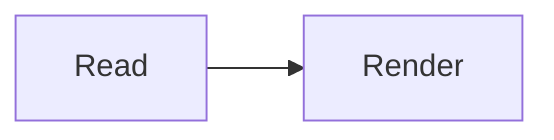

# mdterm example

A heading, **bold**, `code`, and a list:

- one
- two

## Mermaid (placeholder in the pane; box art in the pager)



## Wide ASCII (placeholder in the pane)

```
┌─────────────────────────────────────────────────────────────┐
│                    Frontend / API Callers                     │
│              Web Apps · CLI Tools · Third-Party Clients       │
└──────────────────────────┬──────────────────────────────────┘
```

Narrow code stays visible in the pane:

```
echo hi
```
